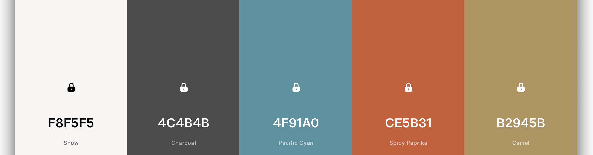

# Guitar Solo™: Audio Research Laboratory of Derek C Zoladz

Notes...

## Commands

All commands are run from the root of the project, from a terminal:

| Command                   | Action                                           |
| :------------------------ | :----------------------------------------------- |
| `npm install`             | Installs dependencies                            |
| `npm run dev`             | Starts local dev server at `localhost:4321`      |
| `npm run build`           | Build your production site to `./dist/`          |
| `npm run preview`         | Preview your build locally, before deploying     |
| `npm run astro ...`       | Run CLI commands like `astro add`, `astro check` |
| `npm run astro -- --help` | Get help using the Astro CLI                     |

## References

* [Unplugin](https://unplugin.unjs.io/)
* [Icônes](https://icones.js.org/)
* [TailwindCSS](https://tailwindcss.com/)
* [SimpleIcons](https://simpleicons.org/)
* [Material Design Icons](https://pictogrammers.com/library/mdi/)

## Color Scheme

## Fonts

* [Atkinson Hyperlegible](https://www.brailleinstitute.org/freefont/)
* [Orbitron](https://www.theleagueofmoveabletype.com/orbitron)